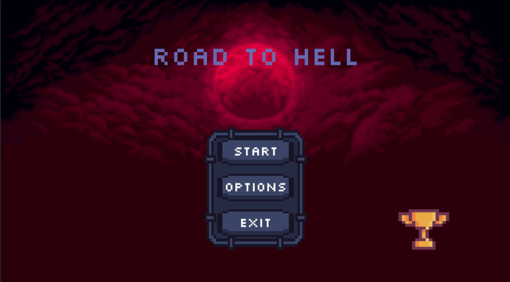
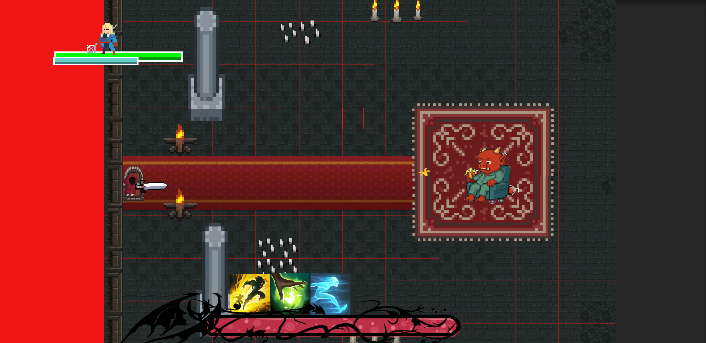
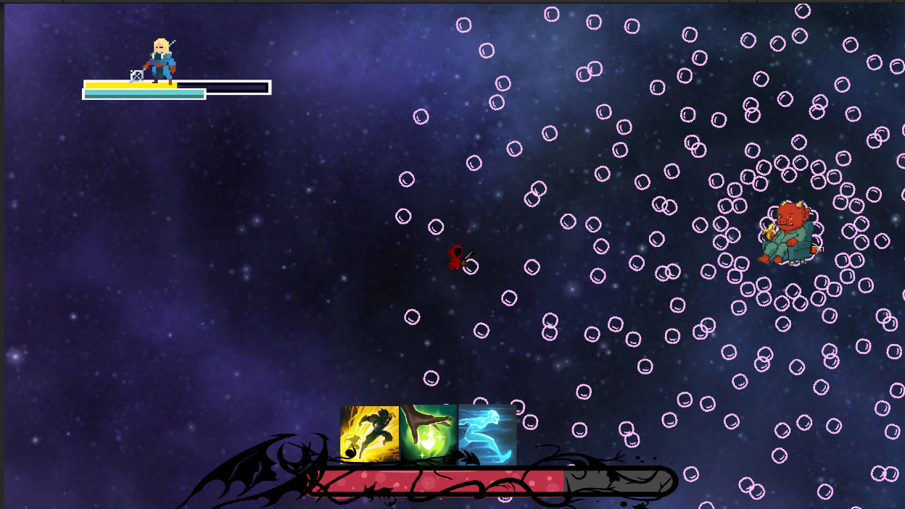

# 苏州大学综合项目实践作业 - 地狱之路

**地狱之路**是一款2D横版弹幕射击游戏，玩家将扮演一名失去记忆的地狱恶鬼，挑战象征人类罪恶的七宗罪BOSS，揭开隐藏在地狱深处的秘密，最终寻求救赎，登上天堂。

## 游戏特色

- **独特的战斗系统**：结合近战与远程武器，玩家需要灵活切换武器，应对不同阶段的BOSS攻击。
- **动态弹幕与交互**：每个BOSS拥有独特的弹幕攻击模式，玩家需精准操作躲避弹幕，同时利用环境与技能反击。
- **梦境与现实切换**：BOSS会将玩家拉入梦境世界，梦境中攻击方式更加诡异，玩家需适应环境变化。
- **碎片化叙事**：击败BOSS后，玩家将逐步夺回记忆碎片，拼凑出主角的过去与真相。
- **高难度挑战**：游戏难度较高，玩家需不断练习，熟悉BOSS攻击模式，才能取得胜利。

## 游戏玩法

- **操作方式**：
  - **WASD**：角色上下左右移动
  - **鼠标左键**：枪械攻击/剑攻击
  - **鼠标右键**：闪现
  - **E键**：治疗
  - **Q键**：疾跑
  - **Tab键**：切换武器
  - **Space键**：枪过热条的校准
  - **ESC键**：游戏暂停

- **游戏目标**：
  - 击败所有七宗罪BOSS，解锁记忆碎片，揭开主角的过去，最终抵达天堂。

## 游戏界面

- **开始界面**：
  - Start：开始游戏
  - Options：设置游戏音量、音效等
  - Exit：退出游戏
  - 成就图标：查看游戏成就

- **关卡选择**：
  - 骷髅头图标代表关卡，上锁的骷髅头表示未解锁，需完成前置关卡。

- **战斗界面**：
  - 左上角显示玩家血量与蓝量。
  - 下方显示技能冷却条与BOSS血量。

## 游戏截图

## 游戏视频

## 项目进度

- **已完成**：
  - 基础游戏框架搭建。
  - 第一个BOSS战（懒惰）的设计与实现。
  - 基础剧情推进机制。

- **进行中**：
  - 剩余BOSS战的设计与实现。
  - 游戏美术资源的进一步完善。
  - 游戏音效与背景音乐的优化。

- **计划中**：
  - 游戏UI与操作手感的优化。
  - 成就系统与额外剧情的添加。
  - 游戏性能优化与平台适配。

